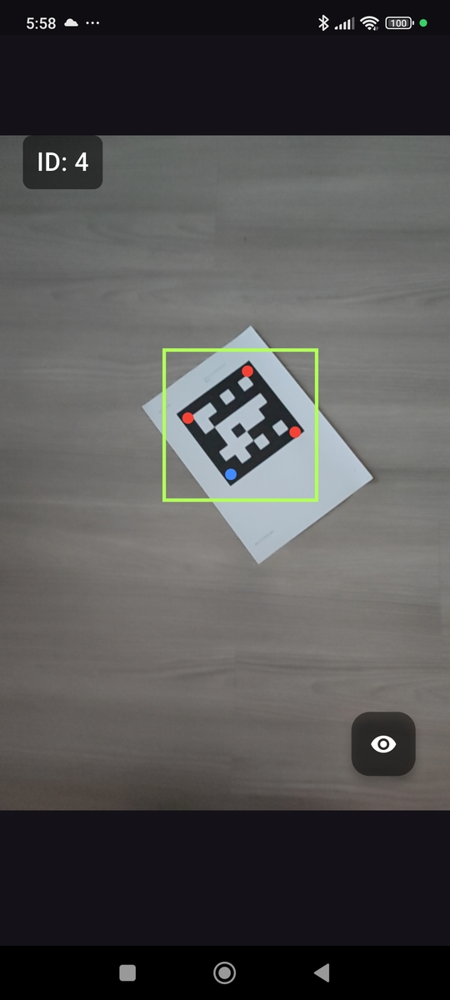
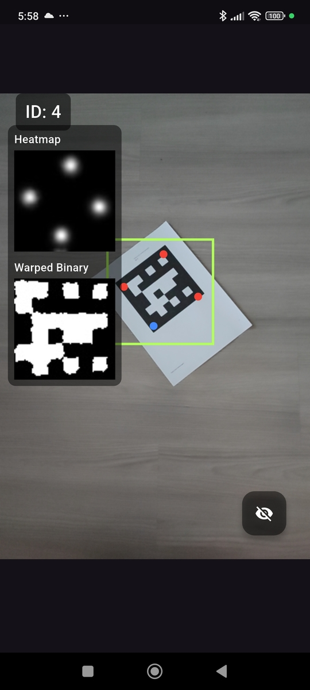

# Flutter DeepArUco App

 


## Introduction

This is a Flutter-based mobile application for the real-time detection and decoding of 6x6 ArUco fiducial markers, especially in challenging lighting conditions. The project is a mobile implementation of the concepts presented in the **DeepArUco++** research paper and is heavily based on the original Python repository.

- **Original Python Repo:** [AVAuco/deeparuco](https://github.com/AVAuco/deeparuco)
- **Research Paper:** [DeepArUco++: improved detection of square fiducial markers in challenging lighting conditions](https://arxiv.org/abs/2411.05552)

This application leverages a deep learning pipeline to provide robust marker tracking on mobile devices.

## Features

- **Real-time Marker Detection:** Uses the device camera to find ArUco markers in the video stream.
- **Robust Decoding:** Implements a multi-stage pipeline to accurately identify marker IDs even under poor lighting.
- **Cross-Platform (in progress):** Built with Flutter for deployment on both Android and iOS from a single codebase.
- **Debug View:** An optional overlay to visualize the heatmap and warped binary images from the processing pipeline.

## How It Works

The application follows the three-stage pipeline proposed by the DeepArUco++ framework:

1.  **Marker Detection (YOLO):** A YOLO-based model first detects the approximate location of one ArUco marker in the camera frame, drawing a bounding box around them.
2.  **Corner Refinement:** The region of interest from the first stage is passed to a second model that refines the location of the marker's four corners with high precision. This is done by analyzing a generated heatmap to find the corner coordinates.
3.  **Marker Decoding:** Once the corners are accurately located, the marker is rectified (warped into a flat square), and a final model decodes the binary pattern to determine its unique ID.

## Models

The app uses several TensorFlow Lite models to perform the detection and decoding tasks.

-   **YOLO Detector:** `android/app/src/main/assets/detector_int8.tflite`
    -   This model is responsible for the initial detection of the markers in the camera feed.
-   **Corner Refiner:** `assets/refiner32.tflite`
    -   This model takes the cropped image of a potential marker and generates a heatmap to precisely locate its corners.
-   **Decoder:** The decoding logic is implemented within the `ProcessingService` using OpenCV functions to read the bits from the rectified marker.

## Platform Support

| Platform | Supported | Tested |
| :------- | :-------: | :----: |
| **Android**| ✅        | ✅     |
| **iOS** | 🚧        | ❌     |

The application has been developed and tested primarily for Android. The iOS implementation has not been completed or tested yet.

## Dependencies

This project relies on several key packages:

-   `camera`: For accessing the device camera stream.
-   `ultralytics_yolo`: For running the YOLO detection model.
-   `tflite_flutter`: For running the corner refiner model.
-   `opencv_dart`: For image processing tasks like perspective warping and marker decoding.
-   `image`: For image manipulation.
-   `integral_isolates`: To run intensive image processing tasks in the background without freezing the UI.
-   `wakelock_plus`: To keep the screen on during active detection.

For a full list, see the `pubspec.yaml` file.

### Dependency gradle requirements
- `opencv_dart` requires ndkVersion assignment in `android/settings.gradle.kts`
```java
gradle.beforeProject {
    if (project.name == "opencv_dart") {
        project.afterEvaluate {
            project.extensions.findByType(com.android.build.gradle.LibraryExtension::class.java)?.let {
                println("Applying ndkVersion to opencv_dart...")
                it.ndkVersion = "23.1.7779620"
            }
        }
    }
}
```
- `tflite_flutter` requires update tensorflow dependency in `android/app/build.gradle.kts`:
```java
dependencies {
    constraints {
        implementation("org.tensorflow:tensorflow-lite:2.17.0")
        implementation("org.tensorflow:tensorflow-lite-gpu:2.17.0")
    }
}
```

## Getting Started

To get a local copy up and running, follow these simple steps.

### Prerequisites

-   Flutter SDK installed.
-   An Android device or emulator.

### Installation

1.  Clone the repo:
    ```sh
    git clone [https://github.com/IoT-gamer/flutter_deep_aruco_app.git](https://github.com/IoT-gamer/flutter_deep_aruco_app.git)
    ```
2.  Navigate to the project directory:
    ```sh
    cd flutter_deep_aruco_app
    ```
3.  Install dependencies:
    ```sh
    flutter pub get
    ```
4.  Run the app:
    ```sh
    flutter run
    ```
## Limitations
- Markers must be 6x6
- Currently only one marker detected at a time
- Currently the decoder is using `DICT_6X6_250`

## License

Distributed under the MIT License. See `LICENSE` for more information.

## Acknowledgments

-   The authors of the **DeepArUco++** paper for their foundational research.
-   The contributors to the original **deeparuco** Python repository.